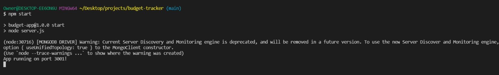

# Welcome to my BUDGET TRACKER!

## Description

#### This BUDGET TRACKER allows users to add expenses and deposits to their budget with or without a connection. If the user enters transactions offline, the total will be updated when the connection is restored and the user is given an alert confirmation to saved transactions.

## Table of Contents
* [Installation](#installation)
* [Usage](#usage)
* [License](#license)
* [Contributor](#contributor)

## Installation
In order to install this repository, you will need to clone it and run npm init and npm install to install all of the dependencies listed inside the package.json file.

## Usage
To use this app after cloning and initializing the dependencies, run npm start in the terminal to start it.

You will then see the confirmation that the app is running.

When you open the port in the browser, the budget tracker opens and you are ready to enter expenses and deposits and see your balance.

This shows the user ability to add a deposit online. 

You will see the transaction has been added.

This shows the user ability to subtract expenses online.

You will see the transaction has been subtracted.

If you lose connection, this shows the user ability to add a deposit offline.

You will see the transaction has been added offline.

This shows the user ability to subtract an expense offline.

You will see the transaction has been subtracted offline.

Once your connection resumes, you will see an alert confirming that your transactions have been added when you're back online.

This app has been deployed through Heroku.

### I hope you enjoy using my BUDGET TRACKER! I welcome all contributions and feedback!

## License
The license for this project is the MIT.

Copyright © 2021

## Contributor
*If you have any questions, please reach out to me.*

### _Jamie Williams_ 

Jamie's GitHub: [@jamwil1226](https://github.com/jamwil1226/)